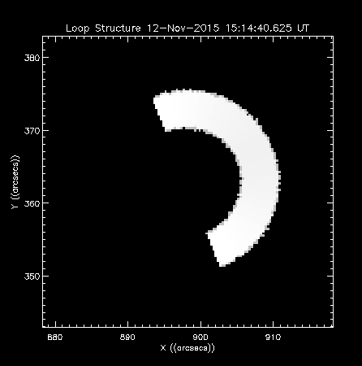

<script src="http://ajax.googleapis.com/ajax/libs/jquery/1.9.1/jquery.min.js"></script>
<style type="text/css">
#fullImg {
    height: auto;
    width: auto;
    max-width: 60vw;
    max-height: 60vh;
}
</style>

<style type="text/css">
#captionedImg {
    height: auto;
    width: auto;
    max-width: 50vw;
    max-height: 50vh;
}
</style>

<section style="text-align: left;">
# Thyr
#### Simulating Microwave Emission from Solar Flares
<br/>
#### Chris Osborne (2087801)
</section>

---
### Project Aims

> - Increased reolution simulation of microwave (MW) emission from flares, in particular the foot regions.
>      - Not resolvable by modern radio astronomy equipment.
>      - Produce an initial idea of what we may see.
>
> - Focus on gyrosynchrotron (GS) emission.
>      - First analytically described by Ramaty in 1969.
>      - Mildly relativistic electrons ($\gamma \sim 5$) spiralling through a magenetic field.

---
### GS Simulation

> - Computer simulation of GS Emission is not a new idea.
>      - First program produced by Ramaty in an early FORTRAN.
>      - We can directly trace our lineage back to that program.

---
### Computer Simulation

> - Why now?
>     - Modern computers are many orders of magnitude more powerful than when Ramaty wrote his original
>     simulation.
>     - Can afford to be "profligate" with computational resources (within reason)
>     - The simulation of $j$ and $k$ is typically less than 50ms per frequency - on this laptop!

---
### Design: Start with the Desired Output...


An emission map plotted in `MATLAB`.

---
### Design: ...And with Prior Art



Output from PJAS' `gyro3d` (IDL)

---
### Main Methods

> - GS Simulation as per PJAS' modified version of Ramaty's code, given a quick optimisation pass
>
> - Volumetric Raytracing
>
> - Original aim was to provide arbitrary flare geometry
>     - This proved harder than expected, provided highly adjustable loop instead.
>     - How adjustable?

---
### Our Loop Model


Our modified torus presenting a flare shape with −20◦ lean, at latitude 30◦ and longitude 70◦. The
shape also presents a 30◦ back angle and 40◦ asymmetry or inclination.

---
### Programming Model

> - Extensible Modern C++ Core
>
> - Interpreted Turing-complete Lua scripting front-end.
>     - Acceptable speed - within factor of 5 of `C` for double precision maths.
>
> - Unless modifying the software beyond its design role, most users should never have need to touch the C++.
>
> - Extensive documentation and examples for the front-end (See users manual). API reference provided for the core.

---
#### Example

```lua
function ArcToCMSun(h)
   -- DegToRad / "perDeg * AstroUnit
   return math.pi / 180.0 / 3600.0 * 1.49597870e13 * h
end

function CMSunToArc(h)
   return h / (math.pi / 180.0 / 3600.0 * 1.49597870e13)
end

densityScaleHeight = CMSunToArc(130e5);
kappa = 10
loopDensity = 10e9
photDensity = 1.16e17

function BMagnitude(s)
   if (math.abs(s) > highResRadialPos) then
      return 600 + ((20 * math.abs(s) - highResRadialPos)
            / (1- highResRadialPos))^2
   else
      return 200 + ((20 * math.abs(s))
            / highResRadialPos)^2
   end
end

function PlasmaDensity(h)
   if (h < highResHeight) then -- roughly based on Battaglia et al. ApJ 752
      local nExp = loopDensity + photDensity * math.exp(-h / densityScaleHeight)
      local nk = photDensity * (1 + h / (kappa * densityScaleHeight))^(-kappa + 1)
      return nExp + nk
   else
      return 1.0e9
   end
end

function Temperature(h)
   if (h < highResHeight) then
      return 5000 + 5000 * (h / highResHeight)
   else
      return 2.0e7
   end
end

function NonThermalDensity(s)
   return 1.0e6
end

function Delta(s)
   return 4.0
end

function EnergyMinMax(s)
   return 10, 5000
end

RT.SetViewportSize(25,25)
RT.AddLoop('l1')
l1.SetSolarSize(8, 2, 0.2)
l1.SetSolarLoc(0, 60, 40, 70)
l1.SetHighRes(2, 2)
l1.SetDomains(20)
RT.CullDomains()
RT.LoadFreqList('logFreqs.csv')
RT.GUpdate()
RT.SaveAllCSVs('flare1')
```

---
### Interface


---
### Interface

> - Previous slide showed interactive interface.
> - Can also be run with pre-written scripts.

---
# Demonstration

---

Current data production method
IDL may be used for emission maps, but not required anywhere now


---
### Current Failings

- Raycasting against large number of domains
    - Currently $O(N^3)$, could be $O(N\log(N))$ using octree culling.
    - Time to implement < 7 days.
    - Look at Ogre3D/Urho3D/my Lethani for source inspiration.
    - Alternative: Replace current domain system with something like BSP
    - Time to implement $\sim$1 month. See Quake/Unreal Engine source.

---
### Current Failings

- Only single power law electron distribution available in Lua.
    - The back-end is already in place, we just need a way to link the two.
    - Time to implement < 3 days.


--- &twocol
## Two columns?

Pls?

*** =left

> - Arghhsdfsd
> - asdfadfs
> - asdf

fdfddf

*** =right

<!--  -->


This **thing** shows a *thing*

---

### A bit of maths?


\(
\begin{equation}
\int_a^{b+1} x^{2x+3}dx = \text{something}
\label{eq:test}
\tag{eq1}
\end{equation}
\)

Look at equation \eqref{eq:test}; it's pretty messed up!


<script>
$('ol.incremental li').addClass('fragment')//note to anyone reading this code, you may need to change to ul from ol depending on ordered vs unordered list
$('ul.incremental li').addClass('fragment')//note to anyone reading this code, you may need to change to ul from ol depending on ordered vs unordered list
</script>
