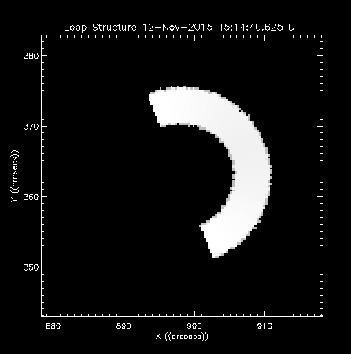
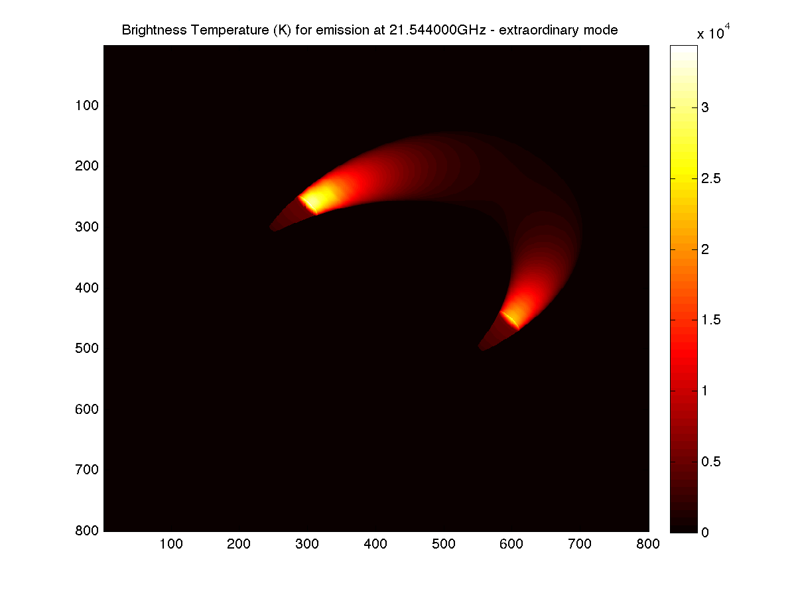
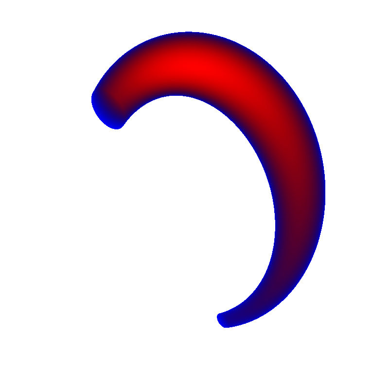
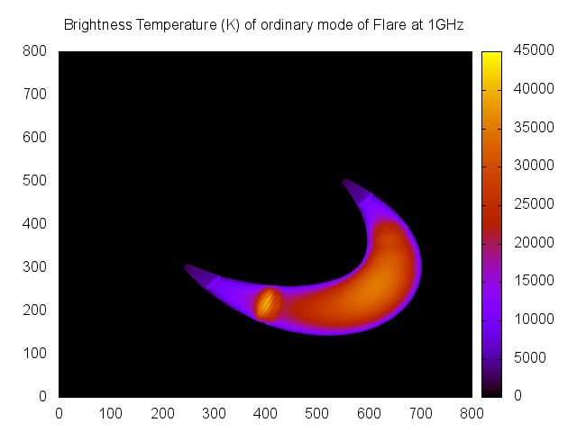
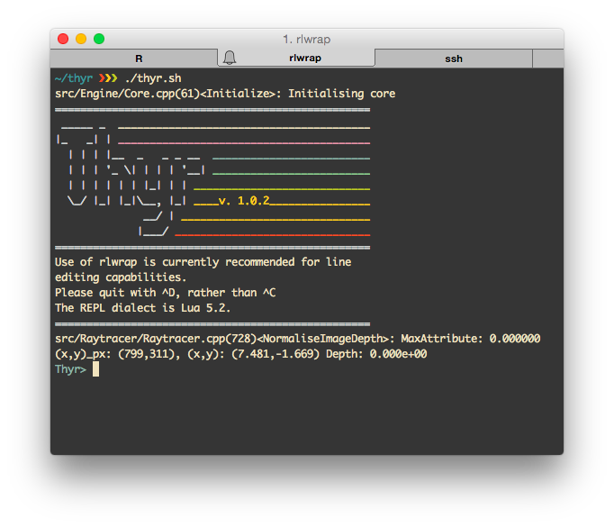
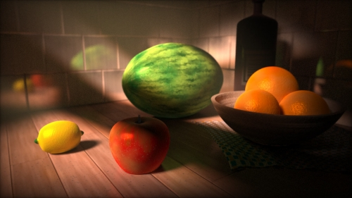

<script src="http://ajax.googleapis.com/ajax/libs/jquery/1.9.1/jquery.min.js"></script>
<style type="text/css">
#fullImg {
    height: auto;
    width: auto;
    max-width: 60vw;
    max-height: 60vh;
}
</style>

<style type="text/css">
#captionedImg {
    height: auto;
    width: auto;
    max-width: 50vw;
    max-height: 50vh;
}
</style>

<section style="text-align: left;">
# Thyr
#### Simulating Microwave Emission from Solar Flares
<br/>
#### Chris Osborne (2087801)
</section>

---
### Project Aims

> - Increased resolution simulation of microwave (MW) emission from flares, in particular the foot regions.
>      - Not resolvable by modern radio astronomy equipment.
>      - Produce an initial idea of what we may see.
>
> - Focus on gyrosynchrotron (GS) emission.
>      - First analytically described by Ramaty in 1969.
>      - Mildly relativistic electrons ($\gamma \sim 5$) spiralling through a magenetic field.

---
### GS Simulation

> - Computer simulation of GS Emission is not a new idea.
>      - First program produced by Ramaty in an early FORTRAN.
>      - We can directly trace our lineage back to that program.

---
### Computer Simulation

> - Why now?
>     - Solve numerically not analytically
>     - Modern computers are many orders of magnitude more powerful than when Ramaty wrote his original
>     simulation.
>     - Can afford to be "profligate" with computational resources (within reason)
>     - The simulation of $j$ and $k$ is typically less than 50ms per frequency - on this laptop!

---
### Design: Start with Previous Developments...



Output from PJAS' `gyro3d` (IDL)

---
### Design: ...And the Desired Output



An emission map plotted in `MATLAB`.

---
### Main Methods

> - GS Simulation as per PJAS' modified version of Ramaty's code, given a quick optimisation pass
>
> - Volumetric Raytracing
>
> - Original aim was to provide arbitrary flare geometry
>     - This proved harder than expected, provided highly adjustable loop instead.
>     - How adjustable?

---
### Our Loop Model



Our modified torus presenting a flare shape with −20$^{\circ}$ lean, at latitude 30$^{\circ}$ and longitude 70$^{\circ}$. The
shape also presents a 30$^{\circ}$ back angle and 40$^{\circ}$ asymmetry or inclination.

---
### Programming Model

> - Extensible modular modern C++ core
>
> - Interpreted full featured Lua scripting front-end.
>     - Acceptable speed - within factor of 5 of C for double precision maths.
>
> - Unless modifying the software beyond its design role, most users should never have need to touch the C++.
>
> - Extensive documentation and examples for the front-end (See users manual). API reference provided for the core.

---

<section style="text-align: left;">
Currently the emission maps are created using a `MATLAB` script (available in the user's manual),
but these are also easily creatable with free software such as `gnuplot`, using the following
script:

```gnuplot
set terminal pdf color
set datafile separator ","
set output "Colormap.pdf"
set key off
set xrange [0:800]
set yrange [0:800]
set title "Brightness Temperature (K) of ordinary mode of Flare at 1GHz"
plot "th.1.000000GHz.O.csv" matrix with image
```

This can easily be meta-programmed using `bash`, `python`, `perl` etc. to automatically fill in the
graph titles from the filenames, much as the `MATLAB` script does.

`IDL` also works well for this task, as does `R` for more in-depth statistical processing.
</section>

---
#### Sample Gnuplot output



---
#### Example

```lua
function ArcToCMSun(h)
   -- DegToRad / "perDeg * AstroUnit
   return math.pi / 180.0 / 3600.0 * 1.49597870e13 * h
end

function CMSunToArc(h)
   return h / (math.pi / 180.0 / 3600.0 * 1.49597870e13)
end

densityScaleHeight = CMSunToArc(130e5);
kappa = 10
loopDensity = 10e9
photDensity = 1.16e17

function BMagnitude(s)
   if (math.abs(s) > highResRadialPos) then
      return 600 + ((20 * math.abs(s) - highResRadialPos)
            / (1- highResRadialPos))^2
   else
      return 200 + ((20 * math.abs(s))
            / highResRadialPos)^2
   end
end

function PlasmaDensity(h)
   if (h < highResHeight) then -- roughly based on Battaglia et al. ApJ 752
      local nExp = loopDensity + photDensity * math.exp(-h / densityScaleHeight)
      local nk = photDensity * (1 + h / (kappa * densityScaleHeight))^(-kappa + 1)
      return nExp + nk
   else
      return 1.0e9
   end
end

function Temperature(h)
   if (h < highResHeight) then
      return 5000 + 5000 * (h / highResHeight)
   else
      return 2.0e7
   end
end

function NonThermalDensity(s)
   return 1.0e6
end

function Delta(s)
   return 4.0
end

function EnergyMinMax(s)
   return 10, 5000
end

RT.SetViewportSize(25,25)
RT.AddLoop('l1')
l1.SetSolarSize(8, 2, 0.2)
l1.SetSolarLoc(0, 60, 40, 70)
l1.SetHighRes(2, 2)
l1.SetDomains(20)
RT.CullDomains()
RT.LoadFreqList('logFreqs.csv')
RT.GUpdate()
RT.SaveAllCSVs('flare1')
```

---
### Interface



---
### Interface

> - Previous slide showed interactive interface.
> - Can also be run with pre-written scripts.

---
# Demonstration


---
### Current Compromises

- Raycasting against large number of domains
    - Currently $O(N^3)$, could be $O(N\log(N))$ using octree sorting.
    - Time to implement: < 7 days.
    - Look at Ogre3D/Urho3D/my Lethani for source inspiration.

- Alternative: Replace current domain system with something like BSP
    - Time to implement $\sim$1 month. See Quake/Unreal Engine source.

---
### Current Compromises

- Only single power law electron distribution available in Lua.
    - The back-end is already in place for multi-power law, we just need a way to link the two.
    - Time to implement: < 3 days.

---

<section style="text-align: left;">
### Current Compromises - A comment


The most time-consuming part of the GS simulation is the Bessel function calculations. These are
responsible for peaks in the emission spectrum, however it may be a good idea to use an
interpolation scheme depending on the precision that is actually required.

Investigation required.

</section>

---
### Further Possibilities

- Other geometry types
    - The algorithms used are applicable to any shape - if it can't be parametrised directly, then we
    can use polygons.
    - Time to implement: $\sim$2 weeks. See raytracers (e.g. POVRay).

- Other frequency ranges
    - If $j$ and $k$ can be calculated for the cloud/plasma, we can use it.
    - Should be a fairly minor modification < 10 days to add a second frequency range (e.g. EUV),
    faster from there.

The above would require slight modifications of currently hard-coded constants if non-solar bodies
were to be analysed.

---
### Further Possibilities

- Allowing the user to define different functions per flare in the multi-loop case.
    - Time to implement: < 4 days

---
### Further Possibilities

- Modern raytracing techniques (raymarching)
    - These techniques could massively increase the resolution and complexity of shapes while improving
    speed and decreasing memory usage (GPGPU).
    - Time to implement: Probably at least 2 months.

---
#### Raymarching



Made by [Íñgo Quílez](http://www.iquilezles.org/prods/index.htm), using a 4KB binary, no external
files, renders on a 4 year old GPU in near real time.

---
### Interesting developments

- A more in-depth survey of the possible variations of parameters that could lead to heavy GS
emission from the flare foot points (and estimating its magnitude)
- Presumably a combination of high density with increased temperature relative to the chromosphere.

---
### Interesting developments

- Reanalysing the situation set up in (Simões & Costa 2006) using a multi-loop model with more
  accurate chromospheric and coronal temperature and density models. Hopefully allowing a direct
  comparision to NoRH and RHESSI data, thus confirming the validity of the models.

---
<section style="text-align: left;">
### Acknowledgements

I would like to thank Dr. Simões (my advisor), and the University of Glasgow Astronomy department
for supporting me and funding this project. I also wish to thank all the coders whose previous work
has been invaluable.

##### Please also see the user's manual and my summer report.
</section>

---
### Questions?
<br/>
<br/>
##### [Chris Osborne](mailto:2087801o@student.gla.ac.uk)

<!-- --- &twocol -->
<!-- ## Two columns? -->

<!-- Pls? -->

<!-- *** =left -->

<!-- > - Arghhsdfsd -->
<!-- > - asdfadfs -->
<!-- > - asdf -->

<!-- *** =right -->

<!--  -->

<!-- This **thing** shows a *thing* -->

<!-- Incremental list fixes (go with jquery at top) -->
<script>
$('ol.incremental li').addClass('fragment')
$('ul.incremental li').addClass('fragment')
</script>
